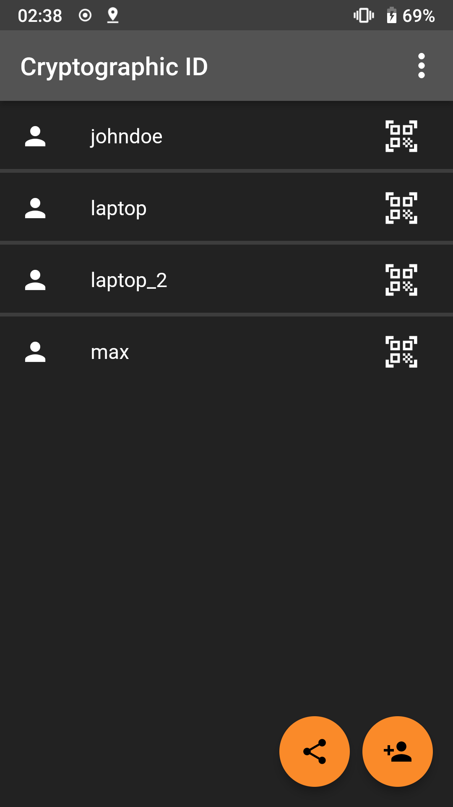
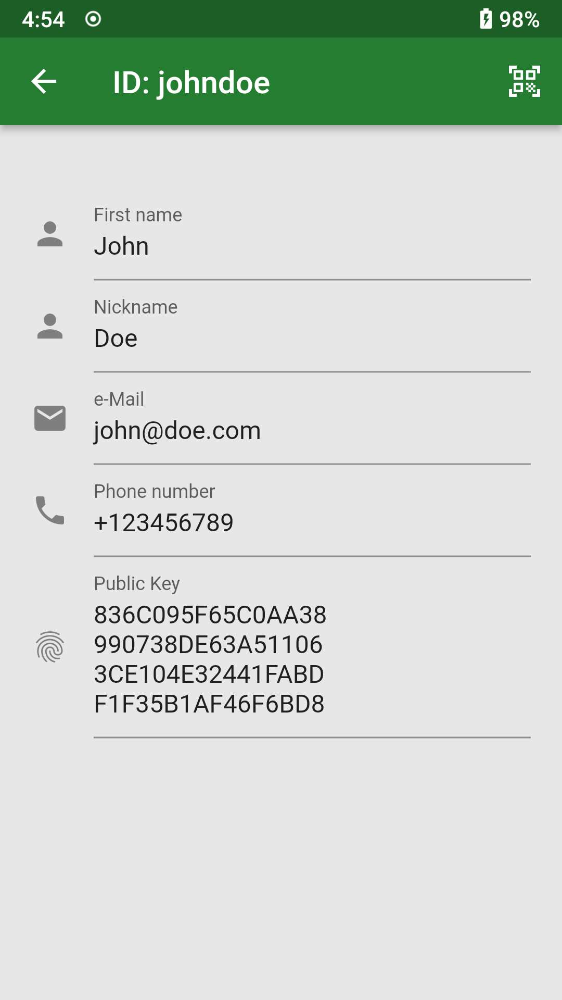
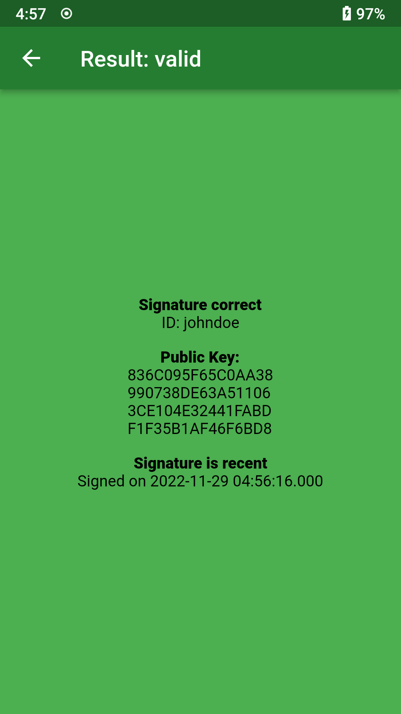
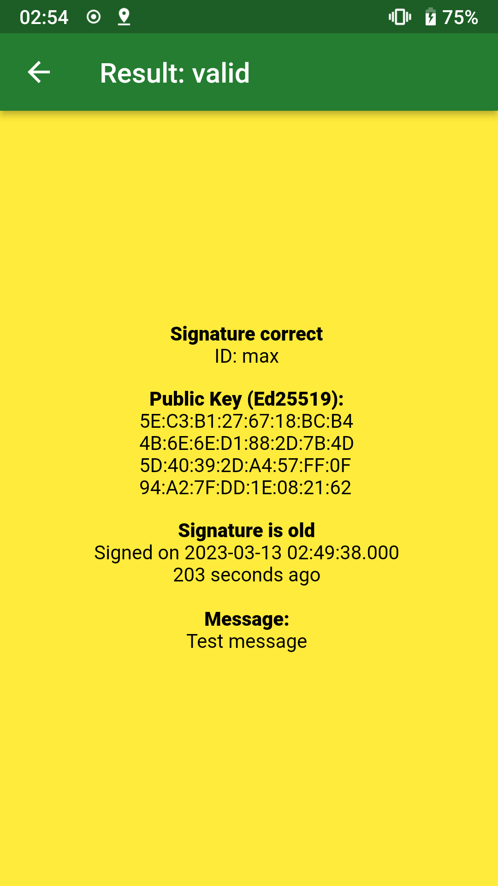
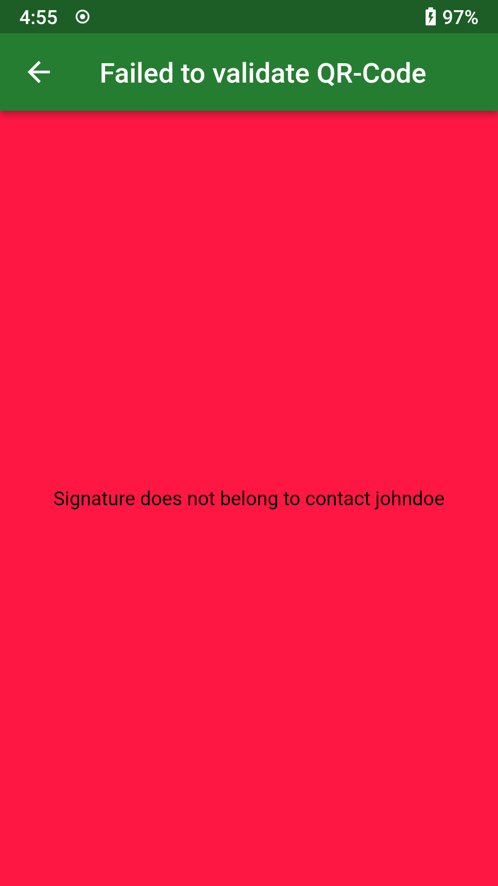
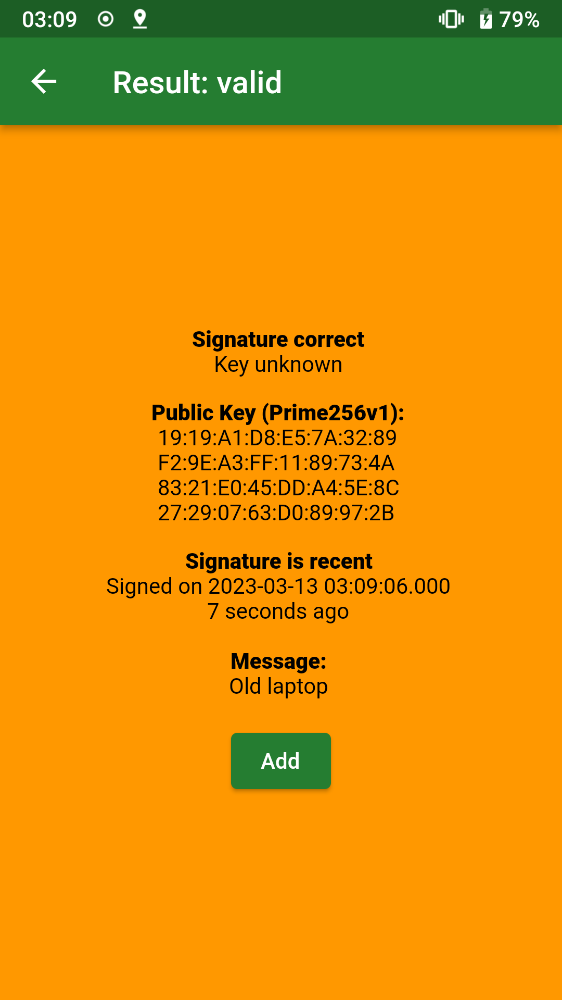
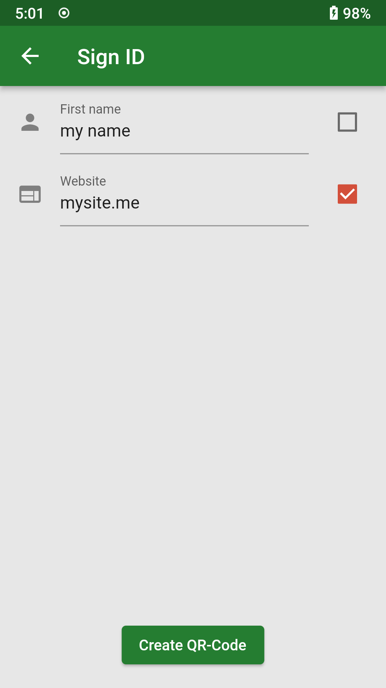
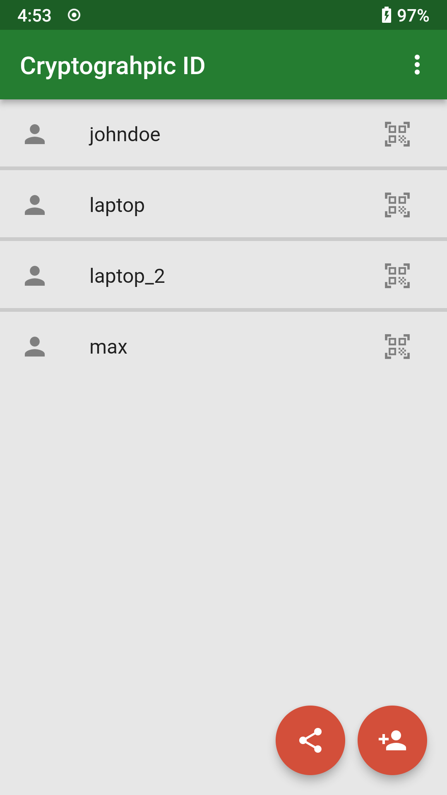

# Cryptographic ID

## Attest the trustworthiness of a device using asymmetric cryptography

This is an Android App to create and verify identities based on ed25519
signatures. This app can also verify prime256v1 signatures to support signatures
generated by a tpm2. It can be used to verify devices (e.g. replace `tpm2-otp`) or
people who are in posession of a private key.

[](https://f-droid.org/packages/io.gitlab.cryptographic_id)

## Setup development environment

Install the dart protobuf plugin:
```bash
flutter pub global activate protoc_plugin
```

Generate the protobuf dart files:
```bash
git submodule update --init --recursive
mkdir -p .dart_tool/flutter_gen/protobuf/
protoc --proto_path=lib/cryptographic-id-protocol --dart_out=.dart_tool/flutter_gen/protobuf lib/cryptographic-id-protocol/cryptographic_id.proto
```

### Build

You can build the app via
```
flutter build apk
```

### Development

To run the app in development mode on your phone, run
```
flutter build
```

### Release

#### Android

If you don't have a keystore yet, create one:
```
../path/to/android-studio/jre/bin/keytool \
	-genkeypair -v \
	-keystore path/to/keystore.jks \
	-keyalg RSA -keysize 4096 -validity 20000 -alias cryptoid
```

Create `android/key.properties`:
```
storePassword=...
keyPassword=...
keyAlias=cryptoid
storeFile=path/to/keystore.jks
```

Create release:

```
flutter build apk --release
```

## Contributing

Please use `flutter analyze` before opening a pull request.

## Screenshots









