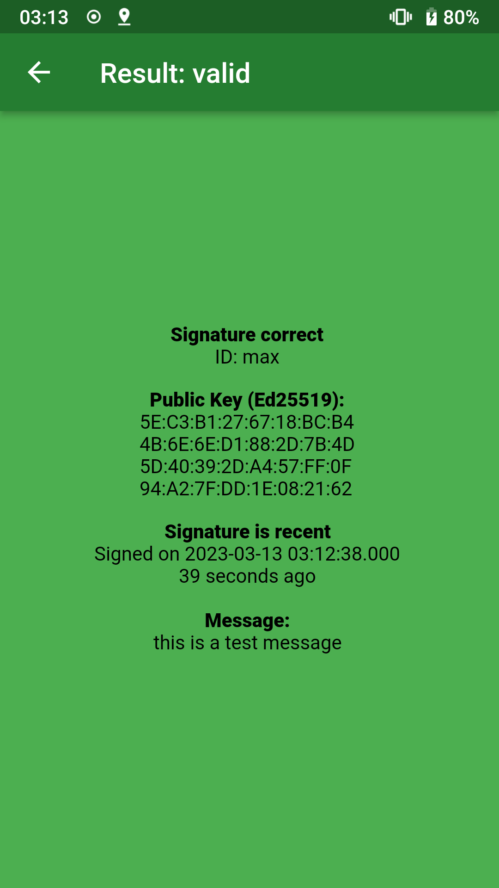

# Cryptographic ID

## Attest the trustworthiness of a device using asymmetric cryptography

This app has three use cases:

##### Attest the state of a Linux computer

When your computer is in a trustworthy state, you can generate a private
key hidden in the TPM2 of your computer. This private key can be sealed with
the current state of the computer (PCRs). Then the computer can only sign a
message with this key when it is in the correct state according to the PCRs.
For example, you can seal the key against the secure boot state (PCR7). If your
computer is booting an operating system signed by another vendor, the TPM2
cannot unseal the private key. So if your computer can generate a correct
signature, it is in this known state.
You can create a sealed private key and create such a signature with
[cryptographic-id-rs](https://gitlab.com/cryptographic_id/cryptographic-id-rs).
This is similar to [tpm2-totp](https://github.com/tpm2-software/tpm2-totp)
but uses asymmetric cryptography. This means you do not need to keep the
verification code a secret, but you can share it safely with the world.

##### Verify the identity of a phone

You can generate a private key when your phone is in a trustworthy state.
If your phone can create a correct signature, you know it is the same phone.
Since the operating system can access the private key, the security guarantees
are much weaker than with a TPM2. So the verification is just as secure as
your phone.
If you use Graphene OS, I recommend [Auditor](https://attestation.app/tutorial)
instead.

##### Verify that a person is in possession of a private key

This works as the section above and has the same shortcomings. It can be used
to verify someone in person when he sends his public key to you
in advance over a secure channel.

[](https://play.google.com/store/apps/details?id=io.gitlab.cryptographic_id.playstore)
[](https://f-droid.org/packages/io.gitlab.cryptographic_id)

## Setup development environment

Install the dart protobuf plugin:
```bash
flutter pub global activate protoc_plugin
```

Generate the protobuf dart files:
```bash
git submodule update --init --recursive
mkdir -p .dart_tool/flutter_gen/protobuf/
protoc --proto_path=lib/cryptographic-id-protocol --dart_out=.dart_tool/flutter_gen/protobuf lib/cryptographic-id-protocol/cryptographic_id.proto
```

### Build

You can build the app via
```
flutter build apk
```

### Development

To run the app in development mode on your phone, run
```
flutter build
```

### Release

#### Android

If you don't have a keystore yet, create one:
```
../path/to/android-studio/jre/bin/keytool \
	-genkeypair -v \
	-keystore path/to/keystore.jks \
	-keyalg RSA -keysize 4096 -validity 20000 -alias cryptoid
```

Create `android/key.properties`:
```
storePassword=...
keyPassword=...
keyAlias=cryptoid
storeFile=path/to/keystore.jks
```

Create release:

```
flutter build apk --release
```

## Contributing

Please use `flutter analyze` before opening a pull request.

## Screenshots





