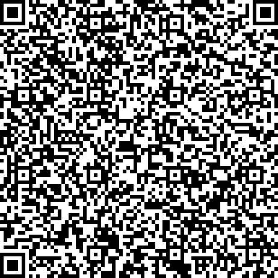
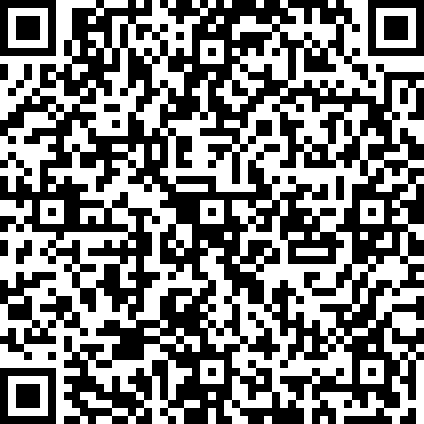
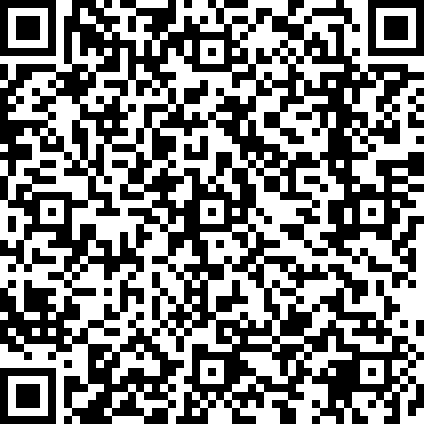
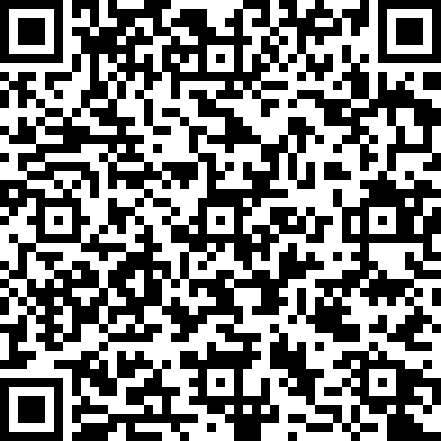
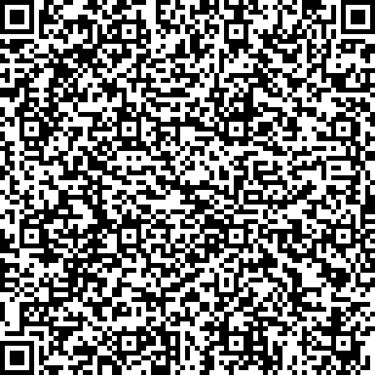
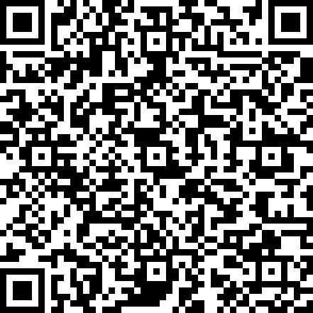
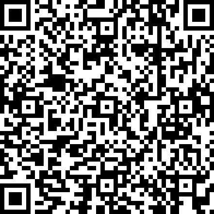

# Example QR-codes

## ED25519

#### Correct signature

#### Different personal information

#### Timestamp in the future

#### Without personal information

#### Invalid signature

#### Invalid info signature

#### Missing public key type

## Other

#### Wrong public key type

