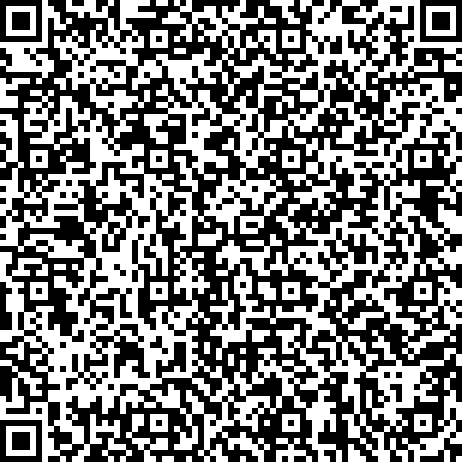

# Example QR-codes

## ED25519

#### correct signature

#### different personal information

#### timestamp in the future

#### without personal information

#### invalid signature

#### invalid info signature

